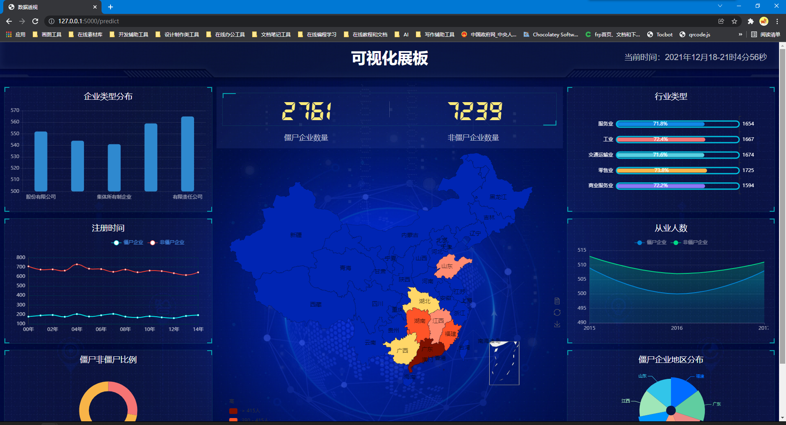

# 僵尸企业识别
僵尸企业分类

模型用到了
- knn
- 逻辑回归(logistic_regression)
- 神经网络(neural_network)
- 随机森林(random_forest)

在model.py中可利用命令行参数 { python model.py --mode train --model [模型名称] --feature [选择使用几个特征] } 运行该文件生成保存模型的model.pkl

model.py 还集成了调参的功能，只需令{ --mode parameter}

模型生成后，可直接运行app.py在网页上显示交互式结果。（google浏览器清除缓存使用ctrl+F5,可以方便调试网页部分的代码）

preprocessing_data.py是数据处理模块，可在其他程序里直接调用。这个模块提供了两个函数，alpha_process_csv()和beta_process_csv()分别针对实验数据，和后

来的测试数据。返回处理后的数据。可选参数有encoder=True, drop_flag=True, standard=True, features=2

- encoder 是否对文本，类别型数据编码（1，2，3...）这样的编码，不是one-hot。
- drop_flag 是否去除flag（即类别标识）为空的数据，默认True，去除之后进行有监督学习。
- standard 是否标准化默认Ture,因为对决策树类的模型不需要标准化。
- feature 选择几个特征默认2。


依赖：

```
python 3.6.10
flask 1.1.1
numpy 1.18.1
sklearn 0.21.3
pandas 0.25.3
matplotlib 3.1.3
```

运行：

```
python run.py
```


